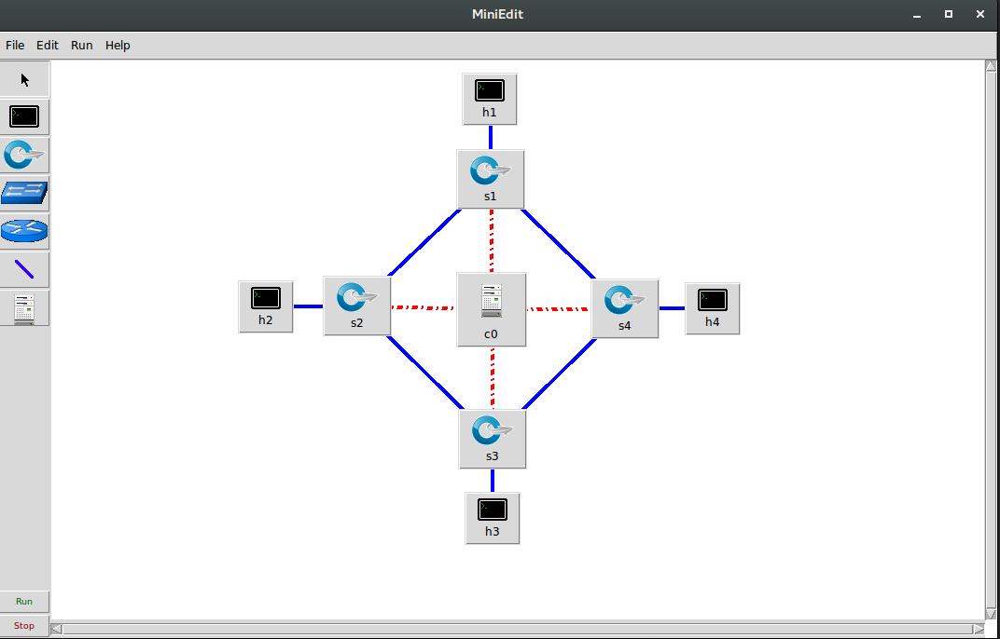

# SDN
Learning how to use SDN with the implementation of small use-cases.

## Resources
The most important resource is the [Ryu Book](https://osrg.github.io/ryu-book/en/Ryubook.pdf). It is detailing how this controller operates, and provides tutorials.

The examples will be implemented inside [Mininet](http://mininet.org/), a network visualization tool.
Incidentally, every command described in this document are meant to be used inside the Mininet virtual machine.

## Basic Mininet Walkthrough

### Documentation
Mininet's options can be listed with `sudo mn -h`.

Specific documentation regarding an equipment or a command can also be accessed from inside the Mininet CLI (i.e. the state after the command `sudo mn` has been entered) with the following commands:

- `help <command>` to get a description of the command's purpose (e.g. `help nodes`).
- `py help(<equipment>)` to get a `man`-like description of the python object, including its functions and attributes (e.g. `py help(c0)`).

Lastly, it is possible to activate different levels of verbosity (e.g. `debug` or `info`) with the command `sudo mn -v <verbosity level>`, where verbosity level is the desired level (all the levels can be accessed with the `sudo mn -h` command).

### Cleaning up after something bad happened

The command `sudo mn -c` can be used to try and fix Mininet's state if it crashes.

This is particularly useful after an error "RTNETLINK: FILE EXISTS".

### Getting information about the topology

When in CLI mode it is possible to access the topology's information with several commands:
- `nodes` to see a list of the nodes, i.e. hosts, switches and controllers.
- `links` to see every link, including both nodes and both interfaces
- `ports` to see every interface of every switch, including which node is connected to this interface
- `net` to display network connections
- `dump` to show every node, every adjacency that belongs to this node, IP addresses and the corresponding pid.

### Creating Topologies

#### When entering CLI

Topologies can be created with `sudo mn --topo=<topo>`, where `<topo>` specifies the shape of the topology (e.g. `tree`, `linear`), and (optionally) the number of hosts.

#### Using Miniedit

[Miniedit](http://www.brianlinkletter.com/how-to-use-miniedit-mininets-graphical-user-interface/) is a GUI that allows one to create topologies graphically.

It can be used to create topologies such as this one :

Miniedit can then be used to specify the equipments' characteristics (e.g. IP addresses, MAC addresses, etc.).

Once the configuration is done, it is possible to start the simulation and to directly open each equipment's CLI.

Lastly, it is possible to save topologies and configurations for later usage.

#### Using Python

Finally, it is also possible to create a Python program that will create the topology.

The code required to create the topology presented above is in [topology.py](topology.py).

An interesting point is that [topology.py](topology.py) works for a number of switches that's lower or equal to two because there are no cycles.
This problem will be addressed in a later section.

### Changing the switch model

Different switch models can support different OpenFlow versions and different features.

In order to change the switch version, the following command is required:

`sudo mm --switch=<switch>`, where `<switch>` can equal several values such as `ovs` (Open VSwitch, which is the default value on my Mininet VM).

### Changing the controller model

Controller models can also be changed.

Setting to controller to Ryu (which is going to be used in the following examples) can be done with the following command:

`sudo mn --controller=ryu`

### Using Wireshark

Wireshark can directly be used inside Mininet to capture and analyze packets using `sudo Wireshark &`.

However, it can't be done in the virtual machine window: it is necessary to setup an SSH access with X forwarding enabled.
The steps required to do so are detailed [here](https://github.com/mininet/openflow-tutorial/wiki/Set-up-Virtual-Machine#access-vm-via-ssh).

### Running commands on specific equipments

Entering a command like `<equipment id> <command>` allows one to run `<command>` on `<equipment id>`.
For example, `h1 ifconfig` will display h1's interfaces.

### Running Tests

Mininet contains specific tests that can be performed on topologies.

It is possible to perform these tests in CLI mode, or in python.

An example of the CLI mode test would be `sudo mn --topo=linear,5 --test=pingall`, where `pingall` will test if hosts can communicate.

[topology.py](topology.py) contains this very same test written in a pythonic way, with the `pingAll()` method.

## Applications

### Handling loops
